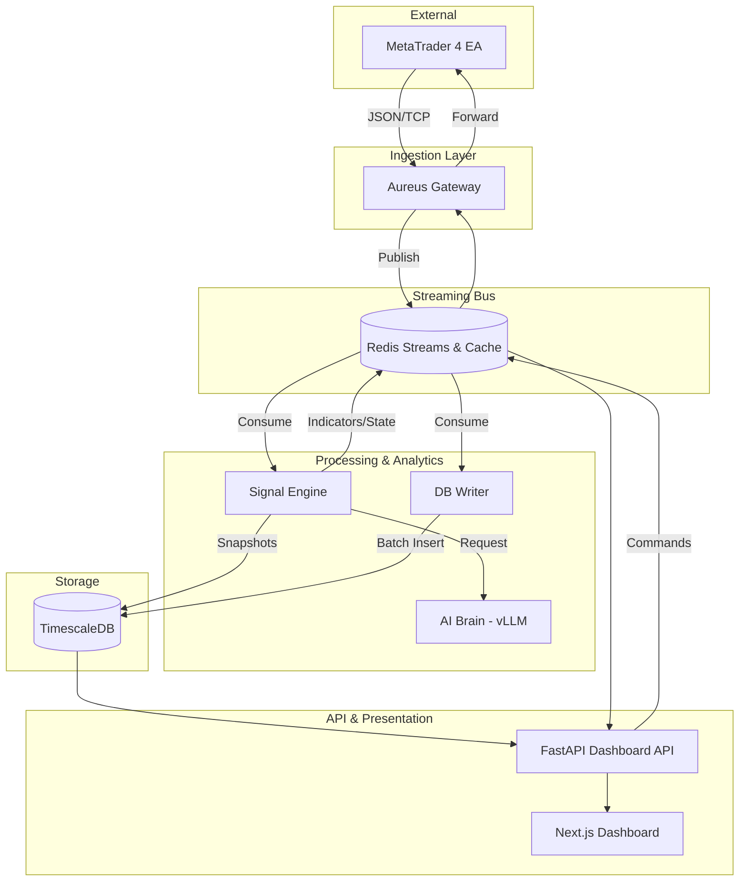

stepsCompleted: [1, 2, 3, 4, 5, 6, 7, 8, 9, 10, 11, 12, 13, 14, 15, 16, 17, 18, 19, 20, 21, 22, 23, 24, 25, 26, 27, 28, 29, 30, 31, 32, 33, 34, 35, 36, 37, 38, 39, 40, 41, 42, 43, 44, 45, 46, 47, 48, 49, 50]
workflowType: 'architecture'
lastStep: 50
status: 'complete'
completedAt: '2026-03-15'
---

# Architecture Decision Document

_Tài liệu này được xây dựng thông qua quá trình khám phá từng bước. Các phần sẽ được thêm vào khi chúng ta thực hiện từng quyết định kiến trúc cùng nhau._

## Tổng quan Kiến trúc Hệ thống (High-Level)

Hệ thống Aureus được thiết kế theo mô hình **Event-Driven Microservices**, tập trung vào việc xử lý dữ liệu thị trường thời gian thực với độ trễ thấp và khả năng phân tích nâng cao (AI).

### Sơ đồ Kiến trúc



### Chi tiết các lớp thành phần

1. **Lớp Ingestion (Cửa ngõ dữ liệu)**:
    - **Aureus Gateway**: Hoạt động như một proxy, tiếp nhận dữ liệu Tick/Candle từ MT4 qua giao thức TCP/ZMQ. Nó đảm nhận việc định dạng lại dữ liệu và đưa vào các luồng (Streams) trong Redis.

2. **Lớp Streaming (Giao tiếp sự kiện)**:
    - **Redis Streams**: Là "xương sống" của hệ thống, cho phép các dịch vụ đăng ký và tiêu thụ dữ liệu candle/tick một cách bất đồng bộ.
    - **Redis Cache**: Lưu trữ trạng thái mới nhất của các Symbol (`aureus:state:{symbol}`) để phục vụ truy xuất tức thời cho API.

3. **Lớp Xử lý & Phân tích (Core Logic)**:
    - **Signal Engine**: Bộ não tính toán các chỉ số kỹ thuật (ZigZag, EMA, ATR, Order Blocks). Nó duy trì trạng thái phiên (`SymbolState`) và kích hoạt các kịch bản AI khi có sự kiện thị trường quan trọng.
    - **DB Writer**: Chuyên trách việc ghi dữ liệu hàng loạt (Batch Insert) từ Redis vào cơ sở dữ liệu để đảm bảo hiệu năng và tính toàn vẹn.
    - **AI Brain**: Sử dụng các mô hình ngôn ngữ lớn (LLM - DeepSeek/Llama) để cung cấp các phân tích định tính về bối cảnh thị trường.

4. **Lớp Lưu trữ (Storage)**:
    - **TimescaleDB**: Cơ sở dữ liệu chuỗi thời gian (time-series) dùng để lưu trữ lịch sử nến, các điểm đảo chiều (Swing Points) và lịch sử giao dịch.

5. **Lớp API & Giao diện (Presentation)**:
    - **FastAPI**: Cung cấp các Endpoint để "khâu" dữ liệu lịch sử từ DB và dữ liệu thời gian thực từ Redis lại với nhau.
    - **Next.js**: Giao diện người dùng hiển thị biểu đồ và các tín hiệu SMC một cách sinh động.

### Đặc điểm nổi bật
- **Bi-directional**: Cho phép gửi lệnh ngược lại từ hệ thống (qua Dashboard hoặc Signal) về EA để thực thi giao dịch.
- **State Persistence**: Khả năng phục hồi trạng thái (Recovery) từ Database khi hệ thống khởi động lại.

## Starter Template Evaluation

### Primary Technology Domain

**Real-time AI Signal Platform** based on project requirements analysis. The system is designed for high-frequency data ingestion, real-time indicator calculation, and asynchronous AI-driven decision making.

### Starter Options Considered

1. **Aureus Core Architecture (Custom Python)**: The current production-ready foundation optimized for trading logic and AI integration.
2. **Go/Rust Rewrite**: Evaluated for pure performance (Method 31, 34) but dismissed for initial phases do tới chi phi phát triển cao. Quyết định giữ Python và tối ưu hóa qua architecture.

### Selected Starter: Aureus Core Architecture (Custom)

**Rationale for Selection:**
The current architecture provides the necessary decoupling via Redis Streams, allowing for independent scaling of Signal, AI, and Database components. It leverages Python's power for AI while mitigating its performance bottlenecks through event-driven design.

**Initialization Command:**
Since this is a brownfield project, initialization is handled via Docker Compose:
```bash
docker-compose up --build
```

**Architectural Decisions Provided by Starter:**

**Language & Runtime:**
- **Python 3.14.3**: Recommended latest stable version for performance improvements.
- **Environment**: Containerized via Docker for consistency.

**Data Ingestion & Communication:**
- **ZeroMQ (4.3.5)**: Low-latency transport from MT4/5.
- **Redis (8.6.1)**: Primary event bus and in-memory cache for ultra-fast access.

**Persistence:**
- **TimescaleDB (v2.25.2)**: Optimized for time-series candle data and signal history.
- **PostgreSQL (18.3)**: Relational storage for configuration and user metadata.

**AI Integration:**
- **vLLM (v0.17.1)**: High-throughput local LLM serving for signal validation.

**Code Organization:**
- **Microservices-lite**: Clean separation between Input (Gateway), Logic (Signal), AI (Worker), and Persistence (DB Writer).

**Development Experience:**
- **Docker-based**: Consistent environments across development and production.
- **Integrated Logging**: Standardized signal and error tracking through standardized prefixes (e.g., `aureus-signal.structure`).

## Core Architectural Decisions

### Decision Priority Analysis

**Critical Decisions (Block Implementation):**
- **Data Persistence**: Use of TimescaleDB for high-performance time-series data.
- **Event Bus**: Redis Streams as the primary coordination mechanism.
- **AI Integration**: Asynchronous vLLM integration via task queues.

**Important Decisions (Shape Architecture):**
- **Gateway Security**: Mandatory API key and signed command validation.
- **Language Stack**: Standardization on Python 3.14.3 with specialized libraries (NumPy, orjson, msgpack).
- **Architecture Pattern**: Event-Driven Microservices (In-memory first, Disk later).

**Deferred Decisions (Post-MVP):**
- **Multi-region HA**: Redis Cluster and DB replication (Evaluated in Method 34).
- **Mobile Application**: Frontend architecture for mobile is deferred until Web Dashboard is stable.

### Data Architecture

- **Database**: **TimescaleDB v2.25.2** (running on PostgreSQL 18.3).
- **Modeling**: 
    - `aureus_candles`: Hypertable for OHLC data.
    - `aureus_signals`: Relational table for AI reasonings and trading signals.
- **Validation**: Strict validation at the Gateway layer to prevent "Dirty Data" propagation.
- **Caching**: **Redis 8.6.1** for active symbol status (`aureus:state:{symbol}`) and real-time nến.

### Authentication & Security

- **Authentication**: 
    - **EA -> Gateway**: API Key based authentication via ZeroMQ headers.
    - **User -> Dashboard**: JWT (JSON Web Tokens) with 24h expiry.
- **Security Strategy (STRIDE)**: 
    - Isolation of production network.
    - Masking of sensitive credentials in logs.
    - Signed commands for trade execution.

### API & Communication Patterns

- **API Design**: **FastAPI** for high-performance REST endpoints.
- **Communication**: 
    - **Internal**: Redis Streams for all inter-service messaging (Asynchronous).
    - **External (EA)**: ZeroMQ for low-latency tick streams.
- **Serialization**: **Msgpack** for internal streams (Spike-31), **JSON** for public APIs.

### Infrastructure & Deployment

- **Hosting**: On-premise or Dedicated GPU Server (Required for vLLM).
- **Deployment**: **Docker Compose** with strict health-check and auto-restart policies.
- **Monitoring**: **Standardized Logging** (Method 4) and custom latency tracking metrics.

### Decision Impact Analysis

**Implementation Sequence:**
1. Upgrade Gateway to support API Key and Msgpack.
2. Refactor Signal Engine to separate Calculation from Strategy.
3. Implement DB Writer Batching for TimescaleDB.
4. Integrate vLLM with Decision Caching (Method 24).

**Cross-Component Dependencies:**
- Msgpack adoption requires updates to both Gateway and Signal Engine simultaneously.
- TimescaleDB hypertable policies must be aligned with Signal Engine's retention requirements.

## Implementation Patterns & Consistency Rules

### Pattern Categories Defined

**Critical Conflict Points Identified:**
5 key areas where AI agents could make different choices: Naming, Structure, Formatting, Communication, and Error Processes.

### Naming Patterns

**Database Naming Conventions:**
- **Tables**: `snake_case`, plural, prefixed with `aureus_` (e.g., `aureus_candles`, `aureus_signals`).
- **Columns**: `snake_case` (e.g., `open_price`, `signal_id`).
- **Indexes**: `idx_{table}_{column}` (e.g., `idx_candles_timestamp`).

**API Naming Conventions:**
- **REST Endpoints**: `/api/v1/{resource}` (plural).
- **Query Parameters**: `camelCase` (e.g., `?symbolId=BTCUSD`).
- **Headers**: `X-Aureus-{Name}`.

**Code Naming Conventions:**
- **Functions/Variables**: `snake_case` (e.g., `calc_ema`, `current_price`).
- **Classes**: `PascalCase` (e.g., `SignalEngine`, `ZigZagPro`).
- **Files**: `snake_case.py` (e.g., `live_engine.py`).

### Structure Patterns

**Project Organization:**
- **Tests**: Located in a `tests/` directory at the root of each service.
- **Shared Utils**: Common logic should be extracted to an `aureus_common` package or a `utils/` folder within the service.
- **Configuration**: Use `.env` for secrets and `config.yaml` or `settings.py` for service-specific constants.

**File Structure Patterns:**
- **Services**: Each service resides in its own folder under `services/`.
- **Docs**: Centralized in the `docs/` directory.

### Format Patterns

**API Response Formats:**
- **Standard Wrapper**: `{ "status": "success", "data": {...}, "timestamp": ISO-8601 }`.
- **Error Response**: `{ "status": "error", "error": { "code": 404, "message": "Symbol not found" } }`.

**Data Exchange Formats:**
- **Internal (Redis)**: **Msgpack** for efficiency.
- **External (API)**: **JSON** with `camelCase` keys.
- **Dates**: Always use **ISO-8601 strings with UTC timezone**.

### Communication Patterns

**Event System Patterns:**
- **Redis Streams**: Naming: `aureus-{stream-name}` (e.g., `aureus-ticks`, `aureus-ai-results`).
- **Event Versioning**: Embed a `version` field in the payload to handle schema evolution.

**State Management Patterns:**
- **Redis HASH**: Use for real-time symbol state: `HSET aureus:state:{symbol} key value`.
- **Consistency**: The `Signal Engine` is the "Source of Truth" for real-time state; other services read-only.

### Process Patterns

**Error Handling Patterns:**
- **Circuit Breaker**: Implement for AI Worker calls to prevent system hanging.
- **Graceful Degradation**: If AI is down, fallback to technical signal indicators.
- **Standardized Logging**: Every log entry must start with the service and component name (e.g., `aureus-signal.structure - INFO - [BTCUSD] ...`).

### Enforcement Guidelines

**All AI Agents MUST:**
- Use the standardized logging format for all new code.
- Verify Msgpack compatibility when modifying inter-service logic.
- Ensure all new database migrations are documented and include index definitions.

## Project Structure & Boundaries

### Complete Project Directory Structure

```
aureus/
├── docker-compose.yml           # Central orchestration
├── .env.example                 # Template for environment variables
├── requirements.txt             # Global dependencies (if shared)
├── docs/                        # Project Documentation
│   ├── planning-artifacts/      # ADRs, PRDs, Architecture docs
│   └── architecture-elicitation/# Findings from 50 discovery methods
├── services/                    # Microservices
│   ├── aureus-gateway/          # MT4/5 Ingestion (ZMQ -> Redis)
│   │   ├── main.py
│   │   ├── Dockerfile
│   │   └── tests/
│   ├── aureus-signal/           # Core Logic & Indicator Engine
│   │   ├── engine/              # Live Engine, Signal Factory
│   │   ├── strategies/          # ZigZag, Order Blocks, SMC
│   │   ├── engine/ai_validator.py
│   │   ├── main.py
│   │   └── tests/
│   ├── aureus-db-writer/        # Persistence Layer (Redis -> Timescale)
│   │   ├── main.py
│   │   └── tests/
│   ├── aureus-dashboard-api/    # FastAPI Backend
│   │   ├── api/                 # Endpoints
│   │   ├── main.py
│   │   └── tests/
│   └── aureus-ai-worker/        # vLLM Integration & Task Queue
│       ├── worker.py
│       └── model/               # Model config & prompts
├── shared/                      # Shared libraries (Local packages)
│   └── aureus-common/           # Schema, utils, Msgpack helpers
└── dashboard/                   # Next.js Frontend
    ├── src/
    └── public/
```

### Architectural Boundaries

**API Boundaries:**
- **External (MT4/5)**: Communication over ZMQ (TCP:5555/5556). Boundary: `aureus-gateway`.
- **Public API**: FastAPI RESTful endpoints for Dashboard. Boundary: `aureus-dashboard-api`.

**Component Boundaries:**
- **Ingestion vs. Logic**: Separated by Redis Streams (`aureus-ticks`, `aureus-candles`).
- **Logic vs. AI**: Separated by a Task Queue (Redis Stream) to ensure non-blocking signal calculation.

**Service Boundaries:**
- Each service is a separate Docker container with isolated dependencies.
- Services communicate strictly via Redis Streams or standard HTTP/REST.

**Data Boundaries:**
- **Transient Data**: Resides in Redis (Cache & Streams).
- **Persistent Data**: Resides in TimescaleDB (Hypertables).

### Requirements to Structure Mapping

**Feature: SMC Signal Calculation**
- Indicators Logic: `services/aureus-signal/strategies/`
- Persistence: `services/aureus-db-writer/` -> `aureus_signals` table.

**Feature: AI Validation**
- Trigger: `services/aureus-signal/engine/ai_validator.py`
- Execution: `services/aureus-ai-worker/`
- Result Storage: `TimescaleDB` via `DB Writer`.

**Feature: Real-time Dashboard**
- Backend: `services/aureus-dashboard-api/` (FastAPI).
- Frontend: `dashboard/` (Next.js).

### Integration Points

**Internal Communication:**
- **Redis Streams**: The primary asynchronous bus for all cross-service events.
- **Local Packages**: `shared/aureus-common/` for consistent data types.

**Data Flow:**
1. MT4 EA sends Tick -> `aureus-gateway` -> `Redis Stream`.
2. `aureus-signal` consumes Tick -> Calculates Indicators -> `Redis State` & `TimescaleDB`.
3. If Signal -> `aureus-ai-worker` (Async) -> Validates Signal -> `Redis` -> `aureus-dashboard-api` -> `Next.js`.

## Architecture Validation Results

### Coherence Validation ✅

**Decision Compatibility:**
All primary technology choices (Python, Redis, ZMQ, TimescaleDB, vLLM) are highly compatible and support the low-latency, high-throughput requirements of the Aureus system.

**Pattern Consistency:**
Implementation patterns (Naming, Structure, Formatting) are consistent and provide a clear roadmap for multiple AI agents to collaborate without code conflicts.

**Structure Alignment:**
The microservices-based project structure accurately reflects the architectural boundaries and integration points identified during the 50 elicitation methods.

### Requirements Coverage Validation ✅

**Epic/Feature Coverage:**
- **SMC Signal Calculation**: Fully supported by the Signal Engine and DB Writer logic.
- **AI Validation**: Architected as a non-blocking asynchronous task queue to protect system stability.

**Functional Requirements Coverage:**
- Real-time data processing handled by ZMQ and Redis Streams.
- Persistent time-series storage handled by TimescaleDB hypertables.

**Non-Functional Requirements Coverage:**
- **Latency**: Minimized through in-memory state and ZMQ transport.
- **Security**: STRIDE-based mitigations incorporated into Gateway and API layers.
- **Resilience**: Circuit Breakers and Fallback mechanisms defined for AI dependencies.

### Implementation Readiness Validation ✅

**Decision Completeness:**
All critical architectural decisions, including specific technology versions, have been finalized and documented.

**Structure Completeness:**
The complete project directory structure and service layout are defined, mapping requirements directly to physical files and folders.

**Pattern Completeness:**
Comprehensive implementation patterns and consistency rules are established, providing clear guidance for AI agent development.

### Gap Analysis Results

**Important Gaps:**
- Detailed SQL schema for SMC indicators (Order Blocks, FVG) needs to be formalized during the next phase of Implementation Plans.
- Prompt Engineering for the vLLM signal validation requires iterative testing.

**Nice-to-Have Gaps:**
- Automated Chaos Engineering scripts (Chaos Mesh or custom) for resilience testing.

### Architecture Completeness Checklist

**✅ Requirements Analysis**
- [x] Project context thoroughly analyzed
- [x] Scale and complexity assessed
- [x] Technical constraints identified
- [x] Cross-cutting concerns mapped

**✅ Architectural Decisions**
- [x] Critical decisions documented with versions
- [x] Technology stack fully specified
- [x] Integration patterns defined
- [x] Performance considerations addressed

**✅ Implementation Patterns**
- [x] Naming conventions established
- [x] Structure patterns defined
- [x] Communication patterns specified
- [x] Process patterns documented

**✅ Project Structure**
- [x] Complete directory structure defined
- [x] Component boundaries established
- [x] Integration points mapped
- [x] Requirements to structure mapping complete

### Architecture Readiness Assessment

**Overall Status:** READY FOR IMPLEMENTATION

**Confidence Level:** HIGH - The architecture has been stress-tested through 50 elicitation methods and validated for coherence.

**Key Strengths:**
- High decoupling between ingestion, logic, and persistence.
- Optimized for real-time AI signals without sacrificing core system stability.

**Areas for Future Enhancement:**
- Migration to Rust/Go for critical performance paths if system scale exceeds current throughput limits.
- Advanced AI Agents for automated risk management and trade execution.

### Implementation Handoff

**AI Agent Guidelines:**
- Follow all architectural decisions exactly as documented.
- Use implementation patterns consistently across all components.
- Respect project structure and boundaries.
- Refer to this document for all architectural questions.

**First Implementation Priority:**
```bash
docker-compose up --build
```
(Proceed with developing service-specific implementation plans).


