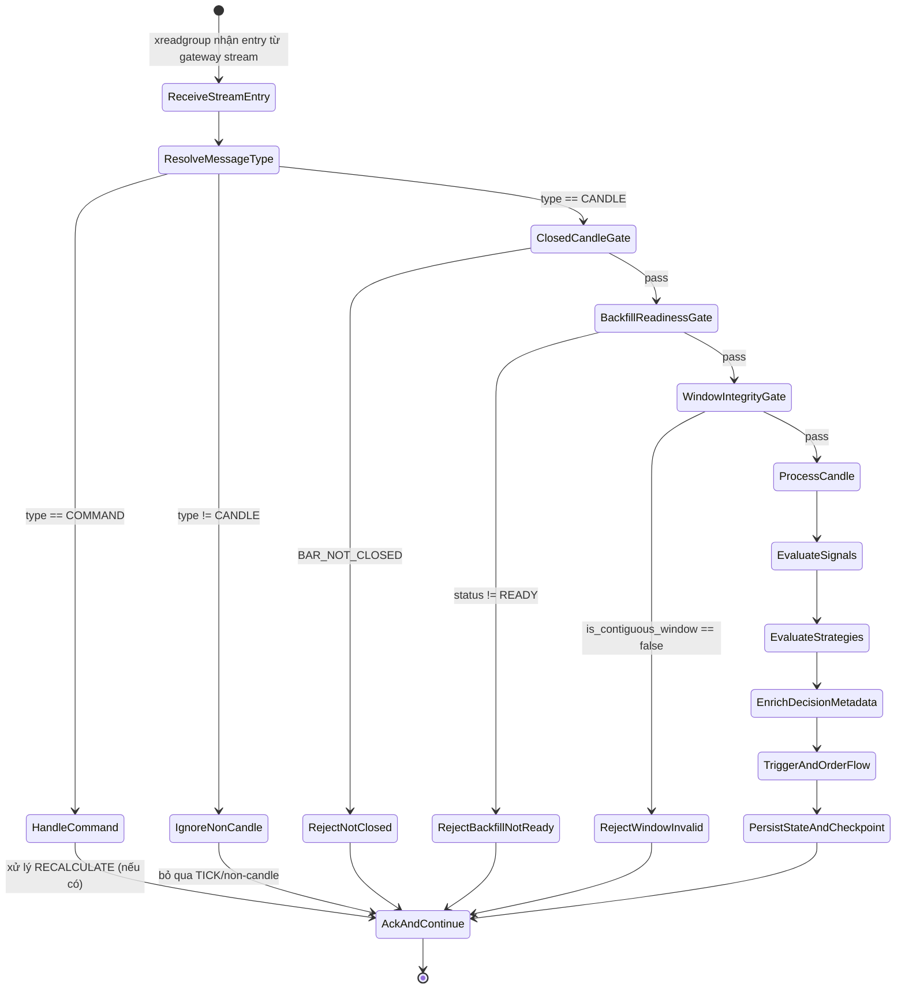

# Live Decision State Machine (Gateway Candle Ingest)

## Mermaid State Machine

## Ý nghĩa từng state

| State | Ý nghĩa | Ảnh hưởng từ phần sửa |
|---|---|---|
| `ReceiveStreamEntry` | Engine nhận entry từ Redis stream (`xreadgroup`). | Không đổi |
| `ResolveMessageType` | Xác định `COMMAND` / `CANDLE` / non-candle. | Không đổi |
| `HandleCommand` | Xử lý lệnh (ví dụ `RECALCULATE`) và set backfill `NOT_READY`. | Không đổi logic chính |
| `IgnoreNonCandle` | Bỏ qua `TICK` hoặc message không phải nến để tránh tính toán thừa. | Không đổi |
| `ClosedCandleGate` | Gate 1: chỉ cho nến đóng đi tiếp (`BAR_NOT_CLOSED` bị reject). | **P1**: thêm fail-closed rõ ràng |
| `BackfillReadinessGate` | Gate 2: chỉ xử lý khi `WindowManager.backfill_status == READY`. | **P2**: chặn xử lý khi warmup/recalc chưa sẵn sàng |
| `WindowIntegrityGate` | Gate 3: yêu cầu window contiguous (không gap/out-of-order). | **P3**: chống dữ liệu lệch chuỗi |
| `ProcessCandle` | Cập nhật window/state với candle hợp lệ. | Được bảo vệ bởi 3 gate phía trước |
| `EvaluateSignals` | Tính các signal trên dữ liệu đã qua gate. | Giảm rủi ro signal sai do data bẩn |
| `EvaluateStrategies` | Đánh giá strategy để tạo candidate decisions. | Chạy trên input ổn định hơn |
| `EnrichDecisionMetadata` | Gắn `spec_version`, `engine_version`, `strategy_version` + `normalized_signal_snapshot`. | **P4–P5**: chuẩn hóa contract & trace metadata |
| `TriggerAndOrderFlow` | Process trigger, update orders, queue AI audit/pulse nếu cần. | Logic cũ giữ nguyên nhưng input sạch hơn |
| `PersistStateAndCheckpoint` | Sync state/snapshot/checkpoint sau xử lý thành công. | Không đổi lớn |
| `RejectNotClosed` | Reject do nến chưa đóng. | **Mới từ P1** |
| `RejectBackfillNotReady` | Reject do backfill chưa `READY`. | **Mới từ P2** |
| `RejectWindowInvalid` | Reject do window integrity fail. | **Mới từ P3** |
| `AckAndContinue` | `xack` entry và kết thúc vòng xử lý event hiện tại. | Chuẩn hóa đường kết thúc cho cả pass/reject |

## Tác động tổng thể của các phần đã sửa (P1–P5)

1. **Fail-closed đúng nghĩa**: luồng strategy/order chỉ chạy khi dữ liệu nến hợp lệ theo 3 gate.
2. **Reject path minh bạch**: mỗi kiểu lỗi có reason rõ (`BAR_NOT_CLOSED`, `BACKFILL_NOT_READY:*`, `WINDOW_NOT_CONTIGUOUS:*`).
3. **Contract output ổn định**: decision luôn có metadata phiên bản + normalized snapshot theo chuẩn.
4. **Dễ audit & replay hơn**: khi replay data có thể đối chiếu được gate reason và metadata đầu ra nhất quán.
