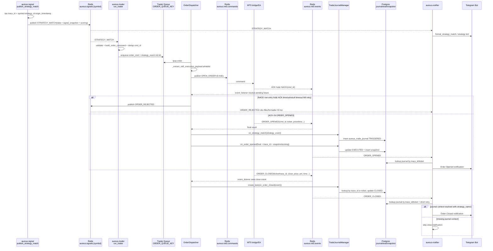

# Design: Strategy trigger → Journal → MT5 → Telegram

## 1. Phạm vi và giả định

Tài liệu này mô tả luồng runtime đã đối chiếu từ source cho một `STRATEGY_MATCH` sau khi strategy trigger được publish: trader nhận event, build order command, dispatch payload tối thiểu sang MT5, persist journal, nhận kết quả lifecycle từ MT5, và gửi Telegram.

Giả định/phạm vi:

- Không mô tả thuật toán tạo tín hiệu/strategy score trước thời điểm `publish_strategy_match`.
- Không mô tả chi tiết EA/terminal MT5 nội bộ; source đã đọc chỉ xác nhận contract Redis command/event giữa Aureus và MT5.
- Không đưa token/chat id/credential vào tài liệu.
- Các điểm không xác nhận trực tiếp từ source đã đọc sẽ ghi rõ thay vì suy đoán.

## 2. Actors/services tham gia

| Actor/service | Vai trò chính | Source đối chiếu |
|---|---|---|
| `aureus-signal` | Tạo/publish `STRATEGY_MATCH` lên Redis channel `aureus:signals:{symbol}`; tạo `trace_id` theo `symbol:strategy_id:origin_timestamp`. | `services/aureus-signal/engine/signal_event_publisher.py` |
| `aureus-trader` main loop | Subscribe signal channels, lọc `STRATEGY_MATCH`, validate, build `OPEN_ORDER`, gắn lại `strategy_event`, dedup `cmd_id`, enqueue order. | `services/aureus-trader/main.py`, `validator.py`, `order_builder.py`, `idempotency.py` |
| `OrderDispatcher` | Pop queue, publish payload tối thiểu sang `aureus:mt5:commands`, chờ ACK/NACK và final result, gọi journal hooks. | `services/aureus-trader/dispatcher.py` |
| `TradeJournalManager` | Persist `aureus_trade_journal`, `aureus_trade_signal_snapshots`; update lifecycle `TRIGGERED` → `EXECUTED` → `CLOSED`. | `services/aureus-trader/journal.py` |
| MT5 bridge/terminal/EA | Nhận `OPEN_ORDER` command, trả `ACK`/`NACK`, `ORDER_OPENED`/`ORDER_FAILED`, và event close qua `aureus:mt5:events`. | Contract thể hiện ở `dispatcher.py`; chi tiết EA chưa xác định từ source đã đọc. |
| `aureus-notifier` | Subscribe signal channels để gửi `SIGNAL_EVENT`/`STRATEGY_MATCH`; đồng thời `OrderStatusReporter` subscribe `aureus:mt5:events` để gửi order lifecycle Telegram. | `services/aureus-notifier/main.py`, `rate_limiter.py`, `formatters.py`, `order_reporter.py` |

## 3. Flow từng bước

### 3.1 Strategy match được publish

1. `publish_strategy_match(redis_client, symbol, strategy_result, active_signals)` lấy `t`, `strategy_id`, `origin_timestamp` và tạo `trace_id = f"{symbol}:{strat_id}:{origin_ts}"`.
2. Payload `data` của `STRATEGY_MATCH` chứa các nhóm chính:
   - định danh/correlation: `trace_id`, `symbol`, `strategy_id`, `strategy_name`;
   - order plan: `side`/`direction`, `entry_type`, `size_value`, `size_mode`, `risk_amount`, `tp_rr_ratio`, `magic_number`, `entry_price`, `sl`, `tp`, `sl_absolute`, `tp_absolute`;
   - explainability/snapshot: `reason_code`, `active_signals`, `signal_snapshot`, `score_total`, `score_breakdown`, `weights_snapshot`, `missing_data_policy`, `score_version`, `signal_schema_version`.
3. Event được publish bằng `publish_signal_event(..., "STRATEGY_MATCH", ...)` lên channel theo symbol.

### 3.2 Trader nhận strategy match và enqueue order

1. `run_trader()` subscribe các channel `aureus:signals:{sym}` theo config.
2. Chỉ event có `type == "STRATEGY_MATCH"` được xử lý.
3. `validate_strategy_match(event)` validate contract event.
4. `build_order_command(event)` tạo command nội bộ `OPEN_ORDER` và `generate_cmd_id(event)` tạo idempotency key dạng `ord-{12-char-md5}` từ `strategy_id`, `symbol`, timestamp signal và direction.
5. Trader gắn `order_cmd["strategy_event"] = event` để giữ context nội bộ cho journal, nhưng context này không bắt buộc được publish sang MT5.
6. `IdempotencyChecker.check_and_mark(order_cmd["cmd_id"])` bỏ qua duplicate trong Redis TTL.
7. `dispatcher.enqueue_order(order_cmd)` push JSON vào queue `ORDER_QUEUE_KEY` nếu queue chưa full.

### 3.3 Dispatch sang MT5 bằng payload tối thiểu

1. `OrderDispatcher.dispatch_loop()` pop queue và gọi `dispatch_order(order)`.
2. `dispatch_order` tạo `mt5_order = self._extract_mt5_execution_payload(order)` trước khi publish.
3. `_extract_mt5_execution_payload` chỉ whitelist các field execution sau nếu có và khác `None`:
   - `type`, `symbol`, `cmd_id`, `direction`, `order_type`, `volume`, `price`, `sl`, `tp`, `magic`, `comment`, `tp_rr_ratio`, `size_mode`, `risk_amount`.
4. Payload này được publish lên `COMMANDS_CHANNEL` (`aureus:mt5:commands` theo config). Các field nặng/nội bộ như `strategy_event`, `signal_snapshot`, `score_breakdown`, `weights_snapshot` không nằm trong whitelist gửi MT5.
5. Dispatcher chờ response theo `cmd_id` qua `_wait_for_response` trên event listener.

### 3.4 ACK/NACK/final result và journal khi order opened

1. Sau khi publish command, dispatcher chờ `ACK`/`NACK` trong `config.ack_timeout`.
2. Nếu timeout ACK: retry exponential backoff cho đến `max_retries`; hết retry thì `_handle_max_retries` publish `ORDER_REJECTED` lên signal channel của symbol.
3. Nếu `NACK`:
   - retry khi `is_retryable` trả true, ví dụ `TRADE_DISABLED`;
   - không retry với `DUPLICATE`, `INVALID_COMMAND`, `UNKNOWN_SYMBOL`; `_handle_rejection` publish `ORDER_REJECTED`.
4. Nếu `ACK`: dispatcher chờ final result trong `config.result_timeout`.
5. Nếu final là `ORDER_OPENED`:
   - lấy `trace_id` từ order nội bộ hoặc final;
   - lấy `strategy_event` từ order nội bộ và gọi `journal.on_strategy_match(strategy_payload)` để tạo journal row `TRIGGERED` nếu có journal;
   - nếu ban đầu thiếu `trace_id`, lấy lại từ `strategy_payload`/`strategy_data` sau `on_strategy_match`;
   - enrich final event với `trace_id`, `signal_snapshot` fallback, scoring payload (`score_total`, `score_breakdown`, `weights_snapshot`, `missing_data_policy`, `score_version`, `signal_schema_version`) và normalize MT5 time;
   - gọi `journal.on_order_opened(final)`.
6. `on_strategy_match` yêu cầu `trace_id`, `strategy_name`, `direction` hợp lệ (`BUY`/`SELL`), `symbol`; sau đó insert `aureus_trade_journal` với `trace_id`, strategy metadata, `active_signals`, `context_filters`, `origin_timestamp`, `ON CONFLICT DO NOTHING`.
7. `on_order_opened` yêu cầu `trace_id`, `ticket`, `entry_price`, MT5 open time. Trong một transaction, function:
   - update `aureus_trade_journal` từ `TRIGGERED` sang `EXECUTED` với ticket, entry price/time, position id, lot, SL/TP;
   - build/persist `aureus_trade_signal_snapshots` từ `event.signal_snapshot` hoặc fallback `active_signals`/`context_filters` từ journal, sau khi strip state tags không persist.

### 3.5 ORDER_CLOSED và journal close

1. `OrderDispatcher.event_listener()` subscribe `EVENTS_CHANNEL` (`aureus:mt5:events` theo config).
2. Khi event type là `ORDER_CLOSED` hoặc `ORDER_CLOSED_PARTIAL`, nếu journal bật:
   - normalize `time`/`close_time` từ `t` nếu cần;
   - tạo task async `journal.on_order_closed(event)` dạng fire-and-forget;
   - callback `_log_journal_task_result` log nếu task bị cancel/fail.
3. `on_order_closed` ưu tiên `trace_id`; nếu thiếu nhưng có `ticket`, lookup journal row `status = 'EXECUTED'` theo ticket để lấy `trace_id`.
4. Nếu không có cả trace_id/ticket, hoặc lookup ticket không thấy journal, function log warning và không close journal.
5. Khi tìm được row `TRIGGERED`/`EXECUTED`, function validate close price và MT5 close time, normalize exit reason, tính duration, result (`WIN`/`LOSS`/`BE`), pips nếu đủ entry price, rồi update `aureus_trade_journal` sang `CLOSED`.

### 3.6 Telegram signal/order lifecycle

Có hai nhánh Telegram chính:

1. Signal/strategy notification:
   - `aureus-notifier.main.run_notifier()` subscribe `aureus:signals:{symbol}`.
   - `passes_filter(filters, event)` lọc event.
   - `RateLimitedDispatcher.enqueue(event, routes)` route theo chat và format:
     - `SIGNAL_EVENT` → `format_signal_event`, gồm symbol, time, session, active signals, indicator snapshot nếu có.
     - `STRATEGY_MATCH` → `format_strategy_match`, gồm symbol, strategy, direction, entry, SL/TP, size, reason, time.
   - `dispatch_loop` gửi qua Telegram sender, dùng bot strategy riêng cho `STRATEGY_MATCH` nếu configured.
2. Order lifecycle notification:
   - `OrderStatusReporter.run()` subscribe `aureus:mt5:events`.
   - `ORDER_OPENED` tạo task `_handle_order_opened`; `ORDER_CLOSED` tạo task `_handle_order_closed`.
   - `_resolve_journal_context` lookup journal theo `trace_id`, fallback theo `ticket`, retry ngắn 2 lần x 0.2s.
   - `_format_opened` gửi context order opened: strategy, score, signal tags, symbol/direction, volume/ticket, entry, SL/TP, RR, time.
   - `_format_close` gửi context order closed: strategy, symbol/direction, net P/L, pips, volume/ticket, entry→exit, RR, time.
   - Với `ORDER_CLOSED`, nếu không resolve được journal hoặc thiếu `strategy_name`, notifier skip notification để tránh fallback sai semantic.

## 4. Bảng data/payload chính

| Payload/data | Field chính | Đi đâu | Ghi chú factual |
|---|---|---|---|
| `STRATEGY_MATCH.data` | `trace_id`, `symbol`, `strategy`, `strategy_id`, `strategy_name`, `side`/`direction`, `entry_type`, `size_value`, `size_mode`, `risk_amount`, `tp_rr_ratio`, `magic_number`, `sl`/`tp`, `entry_price`, `active_signals`, `signal_snapshot`, score fields | Redis signal channel; trader; notifier strategy formatter | `trace_id` được tạo ở signal publisher và nằm trong `data`; trader giữ lại full event trong `strategy_event` nội bộ. |
| Internal `order_cmd` | `OPEN_ORDER` command fields + `strategy_event` | Trader queue nội bộ | Dùng cho dedup, dispatch và journal enrich; không đồng nghĩa payload gửi MT5. |
| MT5 execution payload | `type`, `symbol`, `cmd_id`, `direction`, `order_type`, `volume`, `price`, `sl`, `tp`, `magic`, `comment`, `tp_rr_ratio`, `size_mode`, `risk_amount` | `aureus:mt5:commands` | Whitelist bởi `_extract_mt5_execution_payload`; không gửi `signal_snapshot`/score payload sang MT5 command channel. |
| Journal trigger row | `trace_id`, `strategy_name`, `strategy_id`, `direction`, `symbol`, `score`, `active_signals`, `context_filters`, `origin_timestamp` | `aureus_trade_journal` | Insert trong `on_strategy_match`, `ON CONFLICT DO NOTHING`. |
| Journal opened/snapshot | `ticket`, `entry_price`, `entry_time`, `position_id`, `lot_size`, `sl_initial`, `tp_initial`; normalized snapshot columns | `aureus_trade_journal`, `aureus_trade_signal_snapshots` | Persist trong `on_order_opened` sau `ORDER_OPENED`. |
| Journal close | `exit_price`, `exit_time`, `exit_reason`, `duration_seconds`, `pnl`, `pnl_pips`, `commission`, `swap`, `result` | `aureus_trade_journal` | Persist trong `on_order_closed` sau `ORDER_CLOSED`; fallback lookup by ticket khi thiếu trace_id. |
| Telegram `STRATEGY_MATCH` | symbol, strategy/id, direction, entry, SL, TP, size, reason, time | Signal/strategy bot | Format bởi `format_strategy_match`. |
| Telegram order lifecycle | journal strategy/score/signals + MT5 event order fields | Order bot | Format bởi `OrderStatusReporter._format_opened/_format_close`; close notification bị skip nếu thiếu journal context. |

## 5. Mermaid sequence diagram

## 6. Failure paths chính

| Failure path | Nơi xử lý | Hành vi đã xác nhận |
|---|---|---|
| Missing `trace_id` trong `on_strategy_match` | `TradeJournalManager.on_strategy_match` | Log error `missing trace_id`, return `False`, không insert journal. |
| Missing `trace_id` trong `on_order_opened` | `TradeJournalManager.on_order_opened` | Log warning, return `False`; dispatcher trước đó cố inject trace_id từ order/final/strategy payload. |
| ACK timeout | `OrderDispatcher.dispatch_order` | Retry exponential backoff đến `max_retries`; hết retry gọi `_handle_max_retries` và publish `ORDER_REJECTED` reason `MAX_RETRIES_EXCEEDED`. |
| Result timeout sau ACK | `OrderDispatcher.dispatch_order` | Log warning `Result timeout`, gọi `_handle_max_retries`, publish `ORDER_REJECTED`. |
| NACK duplicate | `is_retryable` + `_handle_rejection` | `DUPLICATE` nằm trong `NON_RETRYABLE_NACK_REASONS`; không retry, publish `ORDER_REJECTED` với reason/event_type từ NACK. |
| Retryable NACK/fail | `is_retryable` | `TRADE_DISABLED`, `MARKET_CLOSED`, hoặc message/reason chứa keyword transient như `server`, `busy` được retry. |
| Thiếu journal context khi `ORDER_CLOSED` | `TradeJournalManager.on_order_closed`, `OrderStatusReporter._handle_order_closed` | Journal fallback lookup by ticket; nếu không thấy thì log warning và return `False`. Notifier skip close notification nếu không resolve journal hoặc thiếu `strategy_name`. |

## 7. Nguồn đối chiếu

Source đã đọc/đối chiếu:

- `services/aureus-signal/engine/signal_event_publisher.py`
  - `publish_strategy_match`
- `services/aureus-trader/main.py`
  - `run_trader`
- `services/aureus-trader/order_builder.py`
  - `generate_cmd_id`
  - `build_order_command`
  - `_build_comment`
- `services/aureus-trader/dispatcher.py`
  - `OrderDispatcher.dispatch_loop`
  - `OrderDispatcher.dispatch_order`
  - `OrderDispatcher.event_listener`
  - `OrderDispatcher._extract_mt5_execution_payload`
  - `OrderDispatcher._handle_rejection`
  - `OrderDispatcher._handle_max_retries`
  - `is_retryable`
- `services/aureus-trader/journal.py`
  - `TradeJournalManager.on_strategy_match`
  - `TradeJournalManager.on_order_opened`
  - `TradeJournalManager.on_order_closed`
  - `_build_signal_snapshot_columns`
  - `_strip_excluded_signal_states`
- `services/aureus-notifier/main.py`
  - `run_notifier`
- `services/aureus-notifier/rate_limiter.py`
  - `RateLimitedDispatcher.enqueue`
  - `RateLimitedDispatcher.dispatch_loop`
- `services/aureus-notifier/formatters.py`
  - `format_signal_event`
  - `format_strategy_match`
- `services/aureus-notifier/order_reporter.py`
  - `OrderStatusReporter.run`
  - `OrderStatusReporter._resolve_journal_context`
  - `OrderStatusReporter._handle_order_opened`
  - `OrderStatusReporter._handle_order_closed`
  - `OrderStatusReporter._format_opened`
  - `OrderStatusReporter._format_close`

Quick summaries đã đọc/tham chiếu:

- `.planning/quick/260423-t4w-t-i-u-ph-n-g-i-data-sang-mt5-cho-t-i-chi/260423-t4w-SUMMARY.md`
- `.planning/STATE.md` mục quick tasks gần đây về trace_id, journal và MT5 timeout.

Ghi chú GitNexus: môi trường tool hiện tại không expose MCP `gitnexus_*`; do task chỉ tạo documentation và không sửa source symbol, không chạy impact analysis trên symbol production.
